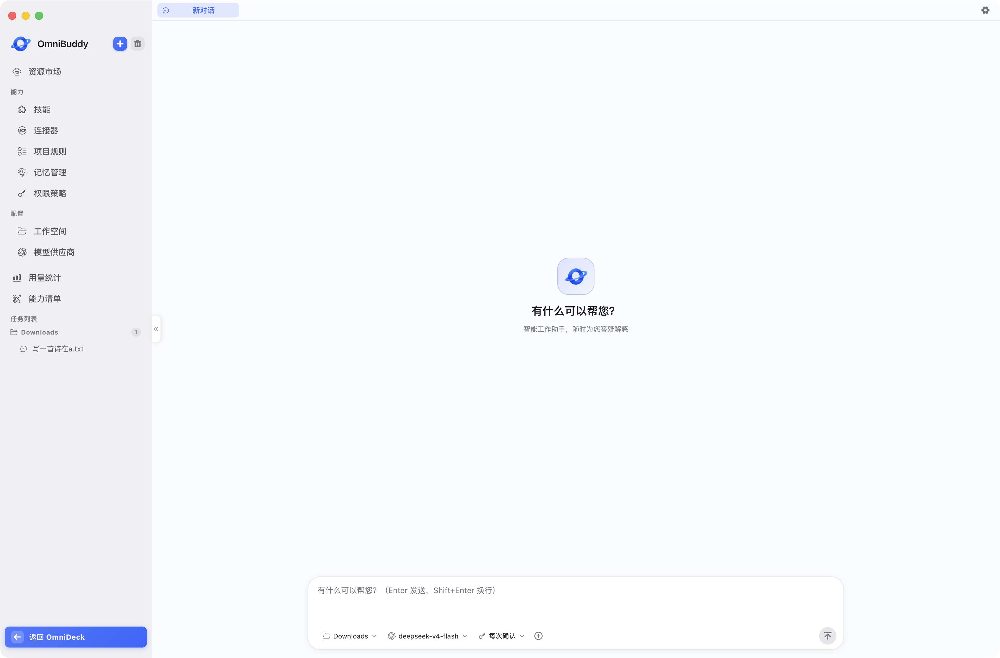
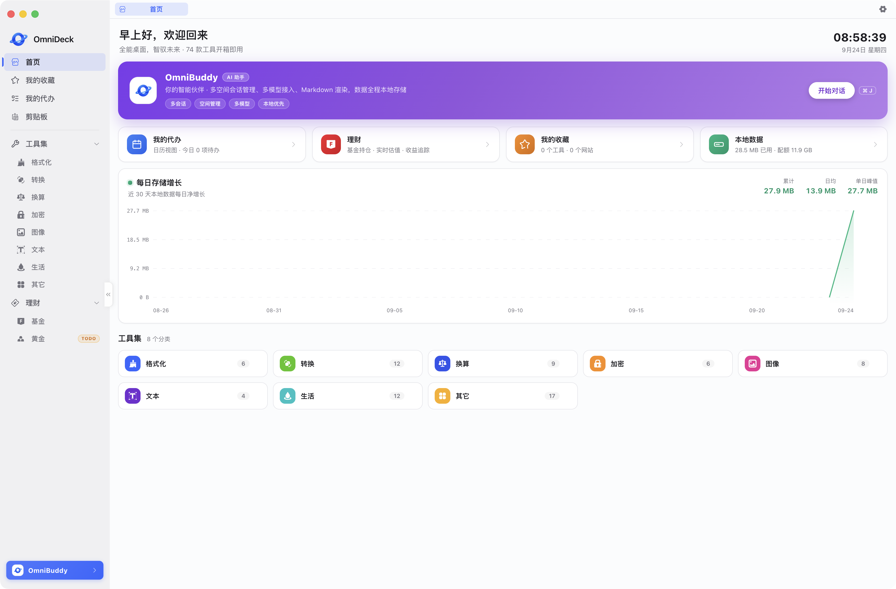
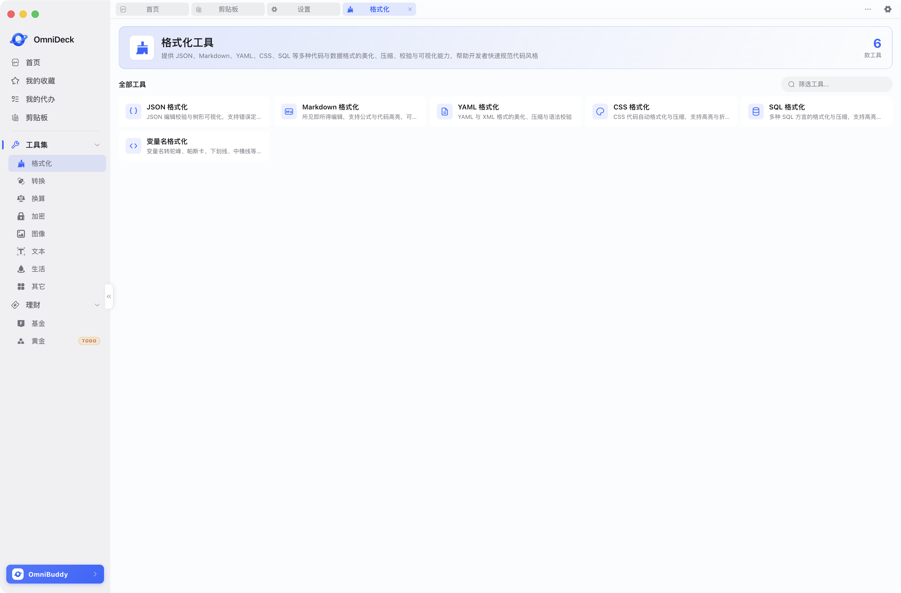
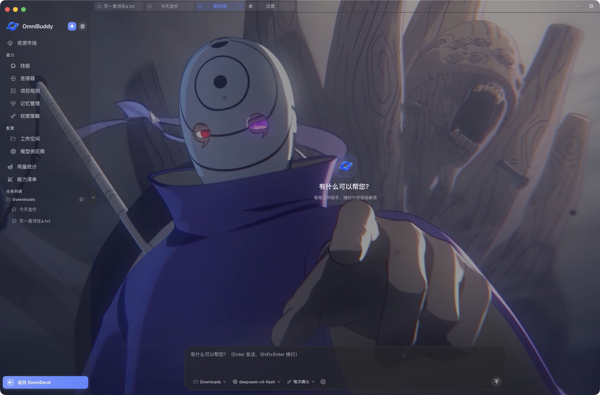
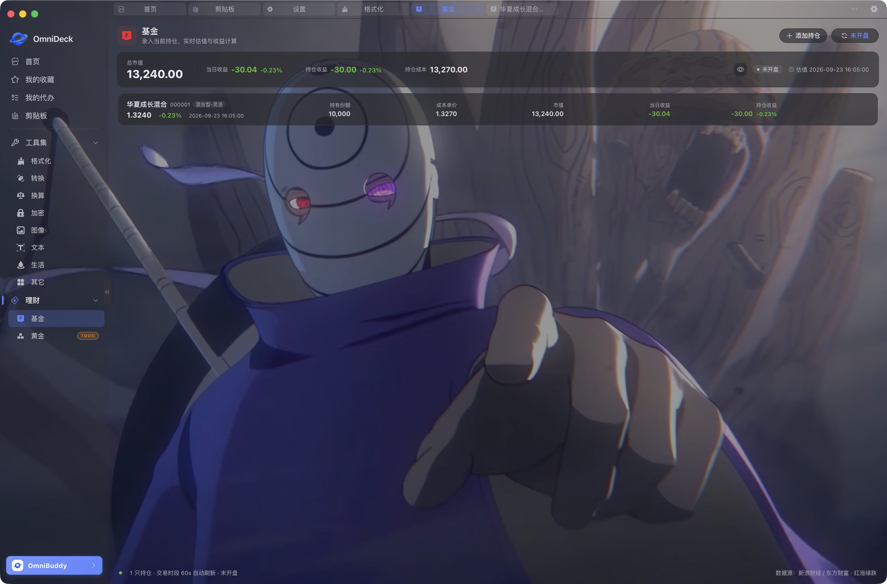
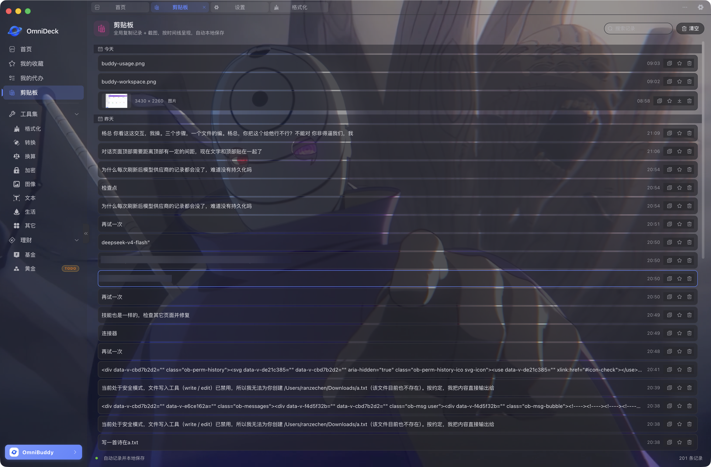

<div align="center">

# OmniDeck

**全能桌面，智驭未来** · Your All-in-One AI-Powered Desktop Toolkit

基于 **Electron + Vue 2** 的跨平台（macOS / Windows）桌面应用，将 **AI 编程助手（OmniBuddy）** 与 **开发者工具箱（OmniDeck）** 融合于一体：既能与 Agent 对话执行任务、管理工作空间与 MCP 连接器，也内置 70+ 离线开发/生活小工具。


| **OmniBuddy · AI 编程助手** | **OmniDeck · 开发者工具箱** |
| :---: | :---: |
|  |  |

</div>

## 为什么选择 OmniDeck

- **离线优先**：工具全部本地运行，数据不出本机；AI 对话凭证经系统钥匙串加密存储
- **装完即用**：自带 python / node / playwright 运行时，无需宿主预装任何环境
- **双引擎合一**：AI 编程助手 + 开发者工具箱共用一套壳，一个应用两种生产力

---

## 核心特性

### OmniBuddy · AI 编程助手

与 Agent 对话即可执行任务、读写工作空间、调用工具。


- **对话**：基于 pi Coding Agent 的多会话对话，支持流式输出、思考过程、任务卡片、问题导航、检查点回滚与消息级用量统计
- **工作空间**：本地目录作为 Agent 工作区，文件浏览 / 预览 / 上传下载
- **我的资料**：个人背景一键注入对话（姓名 / 部门 / 常用项目等），附凭据中心（技能绑定 / AI 按名取用）与全局规则
- **连接器（MCP）**：接入自定义 MCP Server（stdio / Streamable HTTP），配置全量本地保存
- **模型服务商**：多 Provider 管理与凭证保管（系统钥匙串加密存储），支持深度研究档位指派
- **Skill 市场**：Skill 导入 / 导出与扩展市场浏览，凭据统一在「我的资料」录入并绑定技能
- **项目规则**：全局（我的资料）与工作空间（工具栏）两级 `AGENTS.md` 规则编辑，对话时自动注入系统提示词
- **用量统计**：按天 / 会话 / 模型维度的 token 与成本聚合，支持 CSV 导出

### OmniDeck · 开发者工具箱

8 大分类 70+ 工具，全部离线可用，分类页由工厂统一生成，新增工具即插即用。



| 分类 | 亮点工具 |
| --- | --- |
| 转换 | JSON ↔ Excel/SQL/YAML/XML、JSON 转 Java/Go/TS 代码生成、正则测试、时间戳 |
| 加密 | AES/DES/RSA、Hash（MD5/SHA 系列）、Base64/32、随机密码 |
| 格式化 | JSON / Markdown / YAML / CSS / SQL / 变量命名 |
| 图片 | 压缩、格式转换、水印、GIF 制作、二维码、文字图 |
| 文本 | 大小写、VLOOKUP、白板、火星文 |
| 换算 | 字节 / 时间 / 速率 / 长度 / 重量 / 面积 / 体积 / 温度 / 压力 |
| 生活 | 身份证 / 邮编 / 车牌归属、亲属关系、BMI、血压、贷款计算、农历 |
| 其他 | Cron 表达式、HTTP 状态码 / 方法、TCP/UDP 端口、DNS / IP 查询、世界时钟 |

- **财务看板**：基金持仓自选、行情明细、贵金属价格
- **效率面板**：首页仪表盘、收藏夹、待办（Todo）、剪贴板管理、版本更新

### 全局能力



- **截图捕获**：框选 / 窗口拾取（Windows NAPI 窗口枚举）、贴图快面板、滚动截图控制
- **快速命令面板**：Spotlight 式全局搜索与命令入口
- **应用锁**：FaceID / 密码锁定，保护工作区隐私
- **本地壁纸**：图片 / GIF / 视频壁纸，壁纸市场在线浏览
- **系统托盘**：常驻托盘，快速直达常用功能

---

## 应用截图

<!-- 截图说明：MCP 连接器、模型服务商等更多模块暂未配图，功能说明见上方文字列表 -->

| OmniBuddy 工作空间 | 用量统计 |
| :---: | :---: |
|  |  |
| **基金自选** | **基金行情明细** |
|  |  |
| **剪贴板管理** |  |
|  |  |

## Stargazers over time


如果 OmniDeck 对你有帮助，欢迎点一个 Star，这是持续迭代的动力。

---

## 快速上手

### 方式一：下载安装包（推荐）

前往 [Releases](https://gitcode.com/m0_59492087/OmniDeck/releases) 下载对应平台安装包：

- **macOS**：`OmniDeck-<version>-mac-arm64.dmg`
- **Windows**：`OmniDeck-<version>-win-x64.exe`（NSIS 安装包）

> 安装包已内置 python / node / playwright 运行时，安装后即可使用全部功能，无需预装任何环境。

### 方式二：从源码运行

```bash
# 环境要求：Node.js ≥ 16、npm；首次装配与 Electron 构建需可访问网络
npm install

# ① 装配内置运行时（首次 / 切换目标平台时执行一次）
bash scripts/provision-runtime.sh install

# ② 开发调试（Vite dev server + Electron 主进程热更新）
npm run dev

# ③ 打包
npm run build:mac   # macOS DMG
npm run build:win   # Windows NSIS 安装包（x64）

# ④ 发版（打包 + 上传 GitCode Release 附件）
npm run release -- v0.3.0 mac   # 第二参数为 mac | win | all
npm run release -- local mac    # 仅本地打包，不上传
```

产物统一输出至 `release/`，命名 `OmniDeck-${version}-${os}-${arch}.${ext}`。

### 内置运行时装配（进阶）

```bash
bash scripts/provision-runtime.sh fetch   [plat]   # 备料：按清单下载装配包至 lib/<plat>/
bash scripts/provision-runtime.sh install [plat]   # 装配：python/node/node-tools/playwright/npx-cache 落位
bash scripts/provision-runtime.sh verify  [plat]   # 核对：布局 / 可执行 / 版本 / 预装依赖冒烟
```

- `plat` 省略时取当前平台，可选 `darwin-arm64` / `windows-x86_64` 等
- **离线优先**：`lib/<plat>/` 离线备料包已通过 **Git LFS** 入库，clone 即得，命中本地档即解压、不再联网；缺档才在线下载并回存 `lib/` 供后续零网络复用
- **跨平台备料**：解压型组件支持在 mac 宿主上直接为 `windows-x86_64` 落位（`bash scripts/provision-runtime.sh install windows-x86_64`）

<details>
<summary><b>开发者参考（点击展开）</b></summary>

### 打包链路

```
vite build（渲染包 → dist/，主进程 → dist-electron/）
      ↓
electron-builder（files 白名单 + asarUnpack，输出 release/）
      ↓
scripts/afterPack.js 钩子
  ├─ 拷 runtime/<plat>/ → 应用 Resources/runtime/<plat>/（未装配则跳过，不阻塞打包）
  └─ macOS：ad-hoc 签名（codesign --force --deep --sign -）
```

- **mac 签名**：`mac.identity: null` 跳过正式签名，由 afterPack 做 ad-hoc 签名——足以让 Touch ID / safeStorage（keychain）正常工作
- **native 插件**：`native/build/Release/windows.node`（窗口枚举 NAPI）列入 `asarUnpack`；缺失时 `npm run release` 自动 `node-gyp rebuild`
- **上传 Release**：`npm run release` 走 `scripts/release-upload.sh`（预签名 PUT 上传），依赖 git 凭证中的 GitCode token；自动更新走 `package.json → build.publish` 的 generic 源

### 目录结构

```
OmniDeck/
├── build/                  # 应用图标与托盘资源（随 extraResources 打包）
├── native/                 # NAPI 插件（windows.cpp：窗口枚举，截图 hover 拾取用）
├── lib/                    # 运行时离线备料包（Git LFS 管理，按平台分目录）
├── runtime/                # 运行时装配产物（install 生成，打包时拷进安装包）
├── electron/               # Electron 主进程
│   ├── main.js             # 主入口：窗口 / 托盘 / 快捷键 / 生命周期
│   ├── preload.js          # contextBridge：window.electronAPI
│   └── agent/              # OmniBuddy Agent 能力（会话 / 工作空间 / MCP / Skill / 用量…）
├── scripts/                # 构建脚本：运行时装配 / 发版上传 / afterPack 钩子
├── src/                    # 渲染进程（Vue 2）
│   ├── layout/             # 双视图布局（index.vue=Deck，BuddyLayout.vue=Buddy）
│   ├── views/              # 页面：buddy/（chat/workspace/mcp/…）deck/（tools/* finance…）
│   ├── components/         # 共享组件，按域划分：buddy/ deck/ common/ tool/
│   ├── config/             # 工具注册表（tools.js）、应用与基金 API 配置
│   └── utils/              # 工具函数：buddy-api（IPC 桥）/ db / markdown / theme…
```

> 构建产物（`dist/` `dist-electron/`）、装配产物（`runtime/` `release/`）与 `node_modules/` 均已 gitignore，不入库。

### 开发约定

- **组件/页面 import 必须带 `.vue` 后缀**（Vite 4 的 `resolve.extensions` 不含 `.vue`）
- **components 与 views 均按域划分**：`buddy/` `deck/` `common|shared/` `tool/`；页面私有组件 co-locate 在 `views/<域>/<页面>/components/`
- **样式**：全局变量在 `src/styles/variables.scss`，主题色经 CSS 变量注入；Buddy 管理类页面复用 `styles/buddy-settings.scss`
- **IPC**：渲染进程统一经 `src/utils/buddy-api.js` 访问 `window.electronAPI.omnibuddy`，禁止直接触达 preload 细节
- **空状态**：统一使用 `.ob-empty`（挂在 `.ob-manage-page` flex 容器下自动垂直居中）

</details>

---

## 文档

| 文档 | 说明 |
| --- | --- |
| [文档中心](docs/README.md) | 全部文档导航（全局 → deck / buddy 每个功能一个文档） |
| [全局总览](docs/overview.md) | 双视图体系、工具中心工厂、全局能力与存储分层 |
| [功能总索引](docs/feature-overview.md) | 全部功能模块与 70+ 工具的一页式索引 |
| [技术架构](docs/architecture.md) | 进程模型、IPC、存储分层、目录结构与开发约定 |
| [组件与依赖](docs/tech-stack.md) | 技术栈与三方组件盘点 |

## 参与贡献

欢迎通过 Issue 反馈问题与功能建议，或直接提交 Pull Request。

<div align="center">

**OmniDeck** · 全能桌面，智驭未来

</div>
