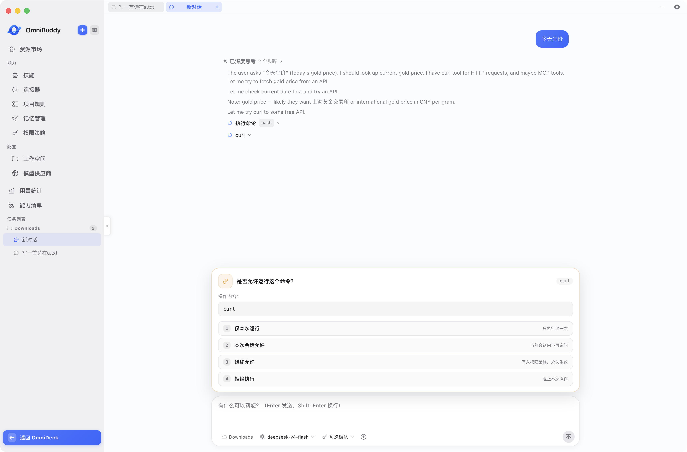

# 对话 Chat

> [← Buddy 文档](README.md)



- **入口路由**：`/omnibuddy`（空白新对话 ?s= 绑定会话 id）
- **源码位置**：[src/views/buddy/chat/index.vue](../../src/views/buddy/chat/index.vue)（含 `components/ChatMessageList.vue`、`components/QuestionOutline.vue`、`CheckpointDrawer.vue`）
- **子组件**：BuddyComposer、ChatPlaceholder、ComposerPicker（`components/buddy/`）；MessageBubble / AskUserCard（ChatMessageList 内）；TodoCard（固定面板，见下）
- **主进程模块**：sessions / pi / llm / attachments / workspaces / permissions / checkpoints / file-changes / sandbox

## 功能定位

pi Agent 流式对话主区：一次问答聚合为一条助手消息（正文 + 内嵌思考 / Skill / 工具块）。

## 页面结构

```
单列消息流（920px 居中）+ 右侧问题导航指示器（QuestionOutline）
  ↓
底部 BuddyComposer 输入区
  ├─ 输入框上方：任务清单固定面板（TodoCard）+ 权限确认浮动条
  └─ 工具区三选择器（工作空间 / 模型 / 权限模式）
+ 检查点 el-drawer（CheckpointDrawer）
```

## 核心功能

### 会话与发送

- 发送首条消息自动建会话，路由带 `?s=` 定位；会话绑定工作空间快照后锁定切换
- 会话侧栏（重命名 / 删除 / 导出）位于 `BuddyLayout.vue`

### 问题导航（QuestionOutline）

- 右侧留白区一列状态圆点（绿=已完成 / 红=已终止 / 黄=输出中 / 灰=等待），垂直居中常驻
- 悬停浮出「问题导航」面板：轮次数、问题文本（超长 hover 滚动）、状态标签
- 点击圆点 / 列表项经 `data-mid` 锚点定位到对应问答位置；当前轮次高亮

### 任务清单（TodoCard）

- **固定面板**：贴输入框上方，不随消息流滚动，与输入框同宽 920px
- **会话内单卡替换**：`todo_update` 事件实时替换旧清单；加载历史只保留最新一条避免回放堆积
- 流式结束后自动收起清单详情；非流式状态下 in_progress 回落为等待中

### 输入区（BuddyComposer）

- **三选择器**：工作空间（必填）/ 模型 / 权限模式（只读 · 自动 · 每次确认）
- **附件**：+ 选择框、拖拽 / 粘贴导入（`pickAttachments` / `importAttachment`）

### 流式事件渲染

支持事件：thinking / delta / tool / skill / ask_user / todo / compaction / sandbox / truncated / rolled_back / interrupted 等，按类型分流到消息内子块。

### 深度研究

三档模型映射（轻量 / 标准 / 强力）取自各供应商的档位配置（见 [providers.md](providers.md)），随消息注入 Agent；未配置档位回落主对话模型。

### 权限确认

- 浮动条四档应答：仅本次 / 本会话 / 始终 / 拒绝，支持键盘 1-4 快捷选择

### 会话管理操作

- **回退 truncate**：消息回退并预填草稿重新编辑
- **分支 branch**：从某条消息分叉新会话
- **中断 interrupt**：停止当前执行
- **检查点 CheckpointDrawer**：时间线展示，一键回滚

## 数据与存储

| 数据 | 位置 |
| --- | --- |
| 模型列表与选中 | IndexedDB（`aiProviderList`、`omnibuddy:providerId`） |
| 空间链接状态 | IndexedDB（`omnibuddy:workspace-link`） |
| 消息 / 会话 / 检查点 | 主进程 pi 目录 |

IPC 方法：`onEvent / getMessages / createSession / sendMessage / interrupt / replyAskUser / replyPermission / truncate / branch / sessionMeta / list·add·renameWorkspaces / pick·importAttachments / get·setPermissionMode / listCheckpoints / rollbackCheckpoint`

## 四、快捷面板 quick

独立壳窗（`/quick`，760×520 无边框置顶）内的常驻 AI 会话，详见 [全局总览](../overview.md#三全局能力层) 与 [clipboard.md](../deck/clipboard.md) 的独立壳窗说明：

- 固定「快捷面板」会话，唤起自动恢复最近会话延续上下文；新话题另起
- 复用主窗口 BuddyComposer / MessageBubble / AskUserCard / ComposerPicker
- 模型 / 工作空间下拉（持久化 `quick:providerId` / `quick:workspaceId`，仅显示目录可用的空间）
- 文件附件、流式事件同主窗口；`permission_ask` 面板内自动 deny
- Esc / 关闭按钮经 `quick.hide()` 隐藏（不销毁）
