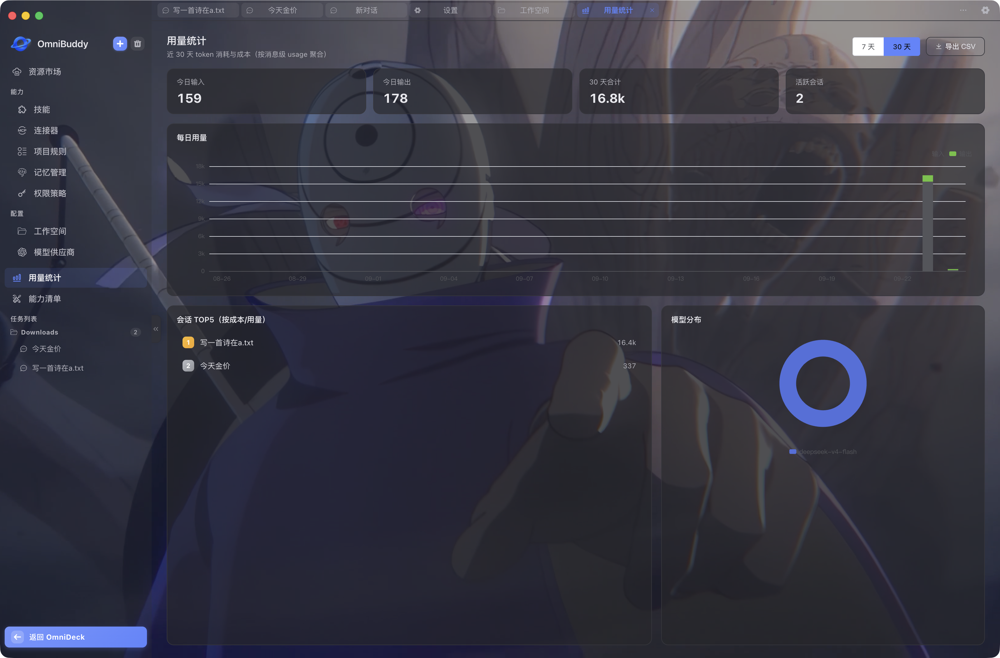

# 用量统计 Usage

> [← Buddy 文档](README.md)



- **入口路由**：`/omnibuddy/usage`
- **源码位置**：[src/views/buddy/usage/index.vue](../../src/views/buddy/usage/index.vue)
- **子组件**：UsageStatCards、DailyBarChart、ModelPieChart（echarts/core 按需引入）、TopSessions
- **主进程模块**：usage.js

## 功能定位

近 30 天 token 消耗与成本看板：按天 / 会话 / 模型三个维度聚合。

## 页面结构

```
头部（7 / 30 天 radio 切换 + 导出 CSV 按钮）
  ↓
统计卡（今日 / 窗口合计 / 会话数）
  ↓
日用量柱状图（DailyBarChart）
  ↓
双列：会话 TOP5（3fr） + 模型分布饼图（2fr）
```

## 核心功能

- **窗口切换**：主进程固定返回 30 天数据，7 天窗口由前端裁剪 daily 与合计
- **导出 CSV**：`usageExportCsv` 调起主进程保存对话框导出
- **图表**：ECharts 按需引入（echarts/core），控制包体

## 数据与存储

| 数据 | 位置 |
| --- | --- |
| 用量明细 | 主进程按消息级 usage 聚合（usage.js） |
| 读取 / 导出 | IPC `usageSummarize()` / `usageExportCsv()` |
